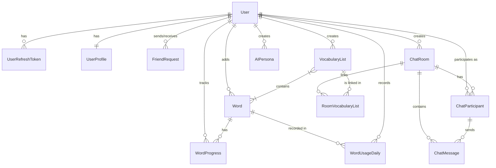

## 1) Introducción

### Definición
**MyLex** es una aplicación diseñada para ayudar a aprender idiomas, potenciada de manera directa con herramientas de **Inteligencia Artificial**.

### Problemática que Resuelve
La plataforma aborda y soluciona dos inconvenientes principales presentes en el aprendizaje tradicional de una nueva lengua:
1. **Falta de inmersión práctica:** Existe una notable ausencia de uso real y cotidiano del vocabulario y de la gramática que el alumno aprende de forma teórica.
2. **Vocabulario descontextualizado:** Los estudiantes se ven obligados a practicar con listas de vocabulario de carácter genérico, sin conocer ni profundizar en el contexto específico o situaciones nativas en las que se emplean dichos términos.

### Cómo lo Resuelve
MyLex replantea la adquisición lingüística mediante tres pilares:
* **Vocabulario de contenido real:** Los términos y expresiones se extraen de manera directa a partir de contenido real, nativo y multimedia en el idioma objeto de estudio.
* **Práctica activa diversificada:** Implementación de dinámicas y ejercicios interactivos variados (Repetición, Escritura, Escucha, entre otros).
* **Inmersión interactiva fluida:** Creación de entornos de socialización y aprendizaje mediante salas de chat que incorporan agentes virtuales de IA y/o usuarios reales de la plataforma.

---

## 2) Requisitos Funcionales

El sistema se compone de ocho módulos funcionales esenciales que estructuran la experiencia de usuario:

### 1. Gestión y Autenticación
* Permite al usuario realizar los flujos estándar de seguridad: Registro de cuenta, Verificación de correo electrónico y Recuperación de contraseña.
* Proporciona un mecanismo de inicio de sesión seguro tradicional e integra la autenticación simplificada con **Google OAuth** una vez que la aplicación se encuentra desplegada en producción.

### 2. Gestión de Vocabulario
* Ofrece la posibilidad de estructurar y crear listas de vocabulario completamente personalizadas.
* Permite añadir nuevos vocablos de forma manual o automatizada junto a su definición y ejemplos de uso, manteniendo la flexibilidad de editar dicha información en cualquier momento.
* Integra una funcionalidad avanzada de **IA para Búsqueda Contextual**, la cual determina y recupera la definición más precisa y adecuada en función del contexto provisto.

### 3. Práctica Activa de Vocabulario
Los usuarios disponen de seis modalidades de ejercicios interactivos diseñados para consolidar el aprendizaje:
* **Repetición:** Tarjetas de repaso dinámicas con oraciones de ejemplo (ej. diferenciación contextualizada en el uso de verbos similares como *watch* o *look*).
* **Ahorcado (Hangman):** Juego interactivo de deletreo que contabiliza aciertos y errores en tiempo real.
* **Memoria Visual:** Dinámica de asociación directa que evalúa al estudiante mostrando imágenes representativas e instándolo a elegir la palabra correcta (ej. *sleep*, *cat*, *spiral*).
* **Sinónimos y Antónimos:** Módulo de evaluación avanzado para validar las relaciones léxicas y semánticas entre términos de diferentes listas de estudio.
* **Escucha (Listening Practice):** Ejercicios de agudización auditiva donde el usuario entrena el oído reconociendo vocablos específicos dentro de una interfaz de reproducción.
* **Escritura (Writing Skills):** Panel de redacción interactivo donde el usuario formula oraciones completas utilizando un set de palabras objetivo (ej. *heaven*, *dog*, *swim*). Cuenta con soporte automatizado mediante un botón de **Check Grammar** y un bloque dedicado de **AI Feedback**.

### 4. Interacción Social
* Capacidad integrada para realizar búsquedas de usuarios dentro de la plataforma utilizando su nombre.
* Flujo social completo para enviar, recibir y gestionar solicitudes de amistad.
* Permite la visualización detallada de los perfiles públicos de otros miembros de la comunidad MyLex.

### 5. Salas de Chat
* Permite la creación y personalización de salas de conversación seleccionando el idioma y la temática específica de interés.
* Ofrece la integración de **participantes simulados mediante Inteligencia Artificial**, permitiendo al creador configurar de manera detallada sus roles, géneros y rasgos de personalidad específicos.
* Cuenta con un mecanismo donde los agentes de IA fuerzan de manera inteligente el uso del vocabulario objetivo que el estudiante necesita aprender.

### 6. Corrector de Gramática
* El backend analiza sintácticamente cada mensaje redactado por el usuario en los chats de manera interactiva.
* Proporciona correcciones automáticas y verifica en tiempo real si el usuario ha logrado emplear correctamente los términos de su lista de estudio.

### 7. Tracking de Progreso
* El sistema recopila información del desempeño diario del usuario para construir analíticas de rendimiento (**Performance Analytics**).
* Calcula y expone visualmente las rachas de estudio continuo (**Streaks**) en días (Racha Actual y Mejor Racha), así como estadísticas gráficas de la actividad de los últimos 7 días y el recuento individualizado de uso por palabra.

### 8. Extensión de Navegador
* Herramienta complementaria para navegadores Chromium que permite capturar términos directamente desde plataformas externas como **YouTube** (capturando el vocabulario de subtítulos o descripciones).
* Ofrece capacidades de búsqueda contextual con IA y almacenamiento inmediato de los nuevos términos en las listas personales del usuario sin necesidad de abandonar la pestaña de navegación actual.

---

## 3) Requisitos No Funcionales

Estas especificaciones aseguran la escalabilidad, el rendimiento óptimo y la robustez técnica de la plataforma:

### 1. Conexión en Tiempo Real con WebSockets
* Implementado de manera obligatoria dentro de las salas de chat para garantizar un flujo continuo e inmediato de mensajería bidireccional.
* Evita la sobrecarga de red y la latencia asociadas a la realización de peticiones HTTP tradicionales.

### 2. Memoria Caché con Redis
* Solución intermedia de alto rendimiento para mitigar el acceso masivo a la base de datos relacional.
* Cuando el cliente efectúa una petición de lectura (`GET /rooms/{room_id}/messages`), el sistema busca el historial en la estructura en memoria (`Chat:{room_id}:history?`). Si no existe, realiza la consulta en PostgreSQL, almacena el resultado en Redis y extiende el tiempo de vida de la caché por un periodo parametrizado de una hora (`CHAT_TTL = 3600`).

### 3. Rendimiento y Optimización Concurrente
* **Funciones Asíncronas:** La lógica central del servidor, la intercomunicación con servicios de IA, la transmisión vía WebSockets y el almacenamiento en Redis están estructurados mediante funciones asíncronas de Python (`async def / await`).
* Esto previene el bloqueo del hilo principal de ejecución mientras se aguardan respuestas de servicios externos lentos, logrando tolerar un alto volumen de usuarios concurrentes con mínima latencia.
* **Rate Limiting:** Inclusión de un componente limitador de tasa de peticiones (*Rate Limiter*) por dirección IP. Protege la infraestructura contra ataques de fuerza bruta y previene la saturación en endpoints computacionalmente demandantes.

### 4. Seguridad de Sesión y Ciclo de Tokens JWT
* Implementación de una arquitectura robusta de autenticación y autorización mediante un flujo estructurado de tokens JWT firmados criptográficamente.
* **Almacenamiento Seguro:** Las claves de sesión se transmiten y guardan en el navegador del cliente mediante cookies protegidas con la directiva `HttpOnly`, eliminando riesgos de robo de credenciales mediante scripts maliciosos (XSS).
* **Access Token:** Con un tiempo de vida corto de **15 minutos**, almacena en su payload la información esencial cifrada del usuario (`id_user` bajo la clave `sub`, `email` y `username`).
* **Refresh Token:** Con una expiración extendida de **30 días**, almacena de forma cifrada el `id_user` y un identificador único global (`jti`). Este token es registrado en la base de datos relacional para permitir el control estricto y la revocación manual de sesiones activas.
* **Flujo ante Expiración:** Al caducar el Access Token, el endpoint devuelve un código de estado `Error 401`. De inmediato, el cliente realiza un `POST /refresh` adjuntando el Refresh Token; el backend descodifica la firma, valida la vigencia en la DB, y genera un Access Token nuevo que reinyecta en las cookies seguras del navegador.

---

## 4) Desarrollo e Implementación

La arquitectura de MyLex sigue los principios de diseño limpio (*Clean Architecture*) y fomenta la modularidad mediante la separación estricta de responsabilidades.

### 1. Backend (Tecnologías Clave)
* **Lenguaje:** Python 3.11+
* **Framework Principal:** FastAPI (utilizado para el desarrollo ágil de endpoints asíncronos y WebSockets).
* **Ecosistema de IA:** LangChain y LangGraph (módulos especializados en la orquestación, estructuración en grafos y control de flujos de prompts entre agentes inteligentes).
* **Capa de Datos:** SQLAlchemy como ORM para el mapeo objeto-relacional y Alembic para el control de versiones técnico y ejecución automatizada de migraciones sobre el esquema de la DB.

### 2. Frontend (Ecosistema de Interfaz)
* **Lenguaje:** JavaScript (JS / ES6+).
* **Librería de Componentes:** React (diseño modular centrado en componentes reutilizables y reactivos).
* **Bundler y Servidor:** Vite (compilación veloz de activos en desarrollo y optimización de archivos estáticos para producción).
* **Framework de Estilos:** Tailwind CSS (maquetación responsiva mediante clases de utilidad fluidas).
* **Estructuración de la Extensión:** CRXJS (compilador encargado de parsear y empaquetar el código React bajo las especificaciones nativas del Manifest de extensiones web de Chromium).

### 3. Base de Datos y Gestión de Caché
* **Estructura Relacional Principal:** PostgreSQL (encargada de la persistencia atómica de datos, perfiles, listas y control de tokens).
* **Estructura No Relacional en Memoria:** Redis (base de datos de clave-valor ultrarrápida dedicada exclusivamente al almacenamiento de sesiones de chat efímeras y caché del historial).


### 4. Infraestructura y Control de Versiones
* **Control de Código:** Git como herramienta local y GitHub como repositorio centralizado en la nube.
* **Contenedores de Infraestructura:** Docker y Docker Compose para garantizar la portabilidad absoluta del sistema, logrando encender las imágenes del backend, frontend, PostgreSQL y Redis de manera automatizada e independiente del sistema operativo anfitrión.
* **Entorno de Desarrollo Integrado:** Visual Studio Code (VSCode).


---

##  5. Manual de Instalación Completo

### Requisitos Previos

* Docker y Docker Compose instalados.
* Node.js y npm (para el entorno de desarrollo del frontend/extensión).
* Python 3.11+ (opcional, si se desea correr fuera de Docker).
* Cuenta de Google Cloud y Groq (para las APIs).

### Paso 1: Clonar el Repositorio

```bash
git clone https://github.com/Fabian-Luna-Vicente/MyLex.git
cd MyLex

```

### Paso 2: Configuración Exhaustiva de Variables de Entorno (`.env`)

Debes crear/duplicar los archivos basados en `.env.example` o `.env.example` y renombrarlos a `.env` en la raíz de los respectivos servicios. A continuación te explicamos **qué poner exactamente en cada variable**.

#### 2.1. Credenciales Base de Datos y Servidor

* `POSTGRES_USER`: Nombre de usuario de la DB (ej. `mylex_admin`).
* `POSTGRES_PASSWORD`: Contraseña segura para la DB (ej. `SuperSecretDB123`).
* `POSTGRES_DB`: Nombre de la base de datos (ej. `mylex_db`).
* `POSTGRES_PORT`: Puerto de PostgreSQL (por defecto `5432`).
* `BACKEND_PORT`: Puerto donde correrá FastAPI (por defecto `8000`).
* `FRONTEND_PORT`: Puerto donde correrá React/Vite (por defecto `5173`).
* `REDIS_URL`: URL de conexión (si usas Docker, usualmente `redis://redis:6379/0`).
* `REDIS_PORT`: Puerto de Redis (por defecto `6379`).
* `BACKEND_BASE_URL`: URL base de tu API (ej. `http://localhost:8000`).
* `FRONTEND_BASE_URL`: URL base de tu frontend (ej. `http://localhost:5173`).

#### 2.2. Seguridad y Tokens (JWT)

* `SECRET_KEY`: Una cadena larga y aleatoria para firmar los tokens JWT. Puedes generarla en tu terminal ejecutando: `openssl rand -hex 32`.
* `ALGORITHM`: El algoritmo de encriptación (usualmente `HS256`).
* `ACCESS_TOKEN_EXPIRE_MINUTES`: Tiempo de vida del token de acceso rápido (ej. `15`).

#### 2.3. Google OAuth (`GOOGLE_CLIENT_ID` y `GOOGLE_CLIENT_SECRET`)

Para habilitar el inicio de sesión con Google (debes tener un dominio válido):

1. Ve a la [Consola de Google Cloud](https://console.cloud.google.com/).
2. Crea un **Nuevo Proyecto** (ej. `MyLex`).
3. Ve a **APIs y Servicios > Pantalla de consentimiento de OAuth**. Selecciona **Externo**, pon el nombre de la app y tu correo de soporte. Guarda y haz clic en **Publicar la aplicación**.
4. Ve a **APIs y Servicios > Credenciales**. Haz clic en **+ CREAR CREDENCIALES > ID de cliente de OAuth**.
5. Selecciona **Aplicación web**.
6. En **Orígenes autorizados de JavaScript** añade: `http://localhost:5173` y `http://127.0.0.1:5173`.
7. En **URI de redireccionamiento autorizados** añade la ruta de tu backend (ej. `http://localhost:8000/api/auth/google/callback`).
8. Se generarán los códigos. Pégalos en tus variables de entorno.

#### 2.4. Google Custom Search para Imágenes (`GOOGLE_IMAGE_API_KEY` y `SEARCH_ENGINE_ID`)

Para que la app busque imágenes asociadas al vocabulario:

1. En la [Consola de Google Cloud](https://console.cloud.google.com/), ve a **APIs y Servicios > Biblioteca**, busca **"Custom Search API"** y haz clic en **Habilitar**.
2. Ve a **Credenciales > + CREAR CREDENCIALES > Clave de API**. Cópiala en `GOOGLE_IMAGE_API_KEY`.
3. Ve a la página del [Motor de Búsqueda Programable de Google](https://programmablesearchengine.google.com/).
4. Crea un nuevo motor. En "¿Qué buscar?", selecciona **Buscar en toda la Web**.
5. **Activa el interruptor de "Búsqueda de imágenes"**.
6. Una vez creado, entra a la configuración básica y copia el **ID del motor de búsqueda** (suele ser una cadena alfanumérica). Pégalo en `SEARCH_ENGINE_ID`.

#### 2.5. Clave API de Groq (`GROQ_API_KEY`)

Para el procesamiento de Lenguaje Natural súper rápido:

1. Regístrate o inicia sesión en [Groq Console](https://console.groq.com/keys).
2. Ve a la sección **API Keys**.
3. Haz clic en **Create API Key**.
4. Copia la clave generada y pégala en `GROQ_API_KEY`.

#### 2.6. Email y Contraseña de Aplicación (`EMAIL_SENDER` y `EMAIL_PASSWORD`)

Para el envío de correos (verificación de cuentas, recuperación de contraseña):

1. `EMAIL_SENDER`: Tu dirección de Gmail desde donde se enviarán los correos.
2. `EMAIL_PASSWORD`: **No es la contraseña de tu correo**. Debes usar una "Contraseña de aplicación".
* Ve a la gestión de tu Cuenta de Google > **Seguridad**.
* Asegúrate de tener activada la **Verificación en dos pasos (2FA)**.
* Busca la opción **Contraseñas de aplicaciones** (puede estar dentro del menú de 2FA).
* Genera una nueva (selecciona "Correo" o pon nombre personalizado como "MyLex Backend").
* Te dará un código de 16 letras (ej. `abcd efgh ijkl mnop`). Pega ese código sin espacios en `EMAIL_PASSWORD`.


### Paso 3: Levantar los Servidores con Docker

Una vez configurados los `.env`, en la raíz del proyecto ejecuta:

```bash
docker compose up --build

```

Esto construirá y levantará los contenedores de PostgreSQL, Redis, Backend (FastAPI) y Frontend (React).

### Paso 4: Migraciones de la Base de Datos

Para generar las tablas en PostgreSQL, en otra terminal ejecuta el siguiente comando para que Alembic estructure la DB:

```bash
docker compose exec -it api alembic upgrade head

```

### Paso 5: Desplegar e Instalar la Extensión de Navegador

Para levantar la extensión (CRXJS + React) que permite capturar palabras:

1. Entra a la carpeta de la extensión e inicia el modo desarrollo:

```bash
cd extension
npm install
npm run dev

```

2. Instálala en Chrome:
* Abre Google Chrome y ve a `chrome://extensions/`.
* Activa el **Modo de desarrollador** (esquina superior derecha).
* Haz clic en **Cargar descomprimida** (Load unpacked) y selecciona la carpeta `/extension/dist` del proyecto.
* ¡Listo! Ancla la extensión, haz clic en el logo e inicia sesión con tu cuenta de MyLex.


---

## 6. Pruebas Automáticas

La plataforma garantiza estabilidad mediante suites de testing rigurosas:

* **Backend (Pytest):** Pruebas en una base de datos aislada y uso de Mocks para las respuestas de la IA.
* **Frontend (Vitest):** Comprobación del renderizado de componentes, simulación del DOM, clicks y eventos del navegador.

---

##  7. Conclusión y Futuras Mejoras

El desarrollo de MyLex abarca un enfoque Full-Stack moderno priorizando escalabilidad, seguridad, rendimiento, y código limpio (SOLID).

**Hitos a futuro:**

1. Integración de modelos Text-to-Speech (ej. **OpenAI Whisper**) para mejorar las habilidades de *listening* de forma más natural e inmersiva.
2. Desarrollo de una **Aplicación Móvil** con notificaciones push para recordatorios de rachas y repaso espaciado.
3. Implementación de una pasarela de pagos (Stripe, PayPal, MercadoPago) para tiers premium dentro de la plataforma.
